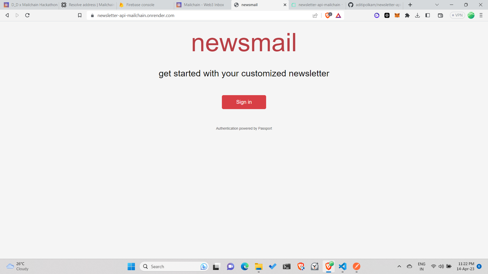
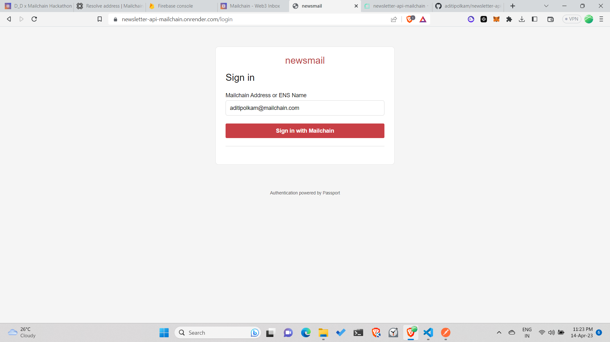
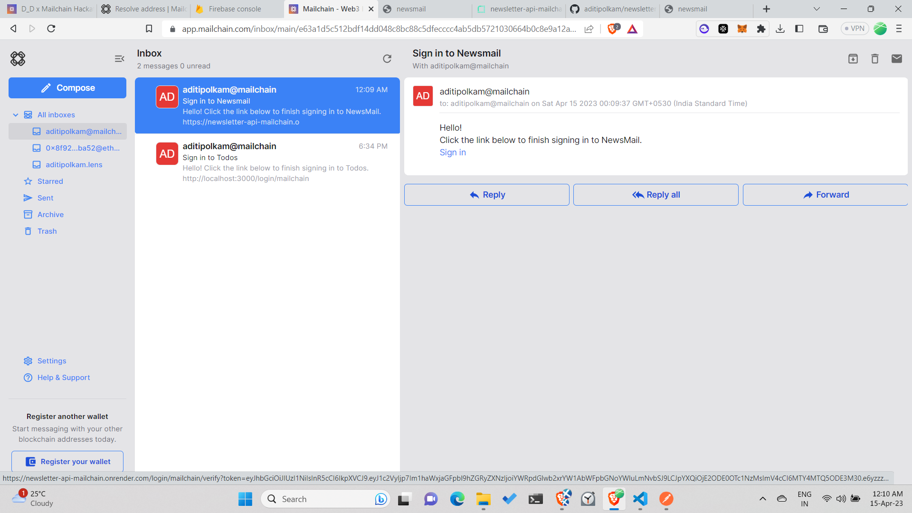
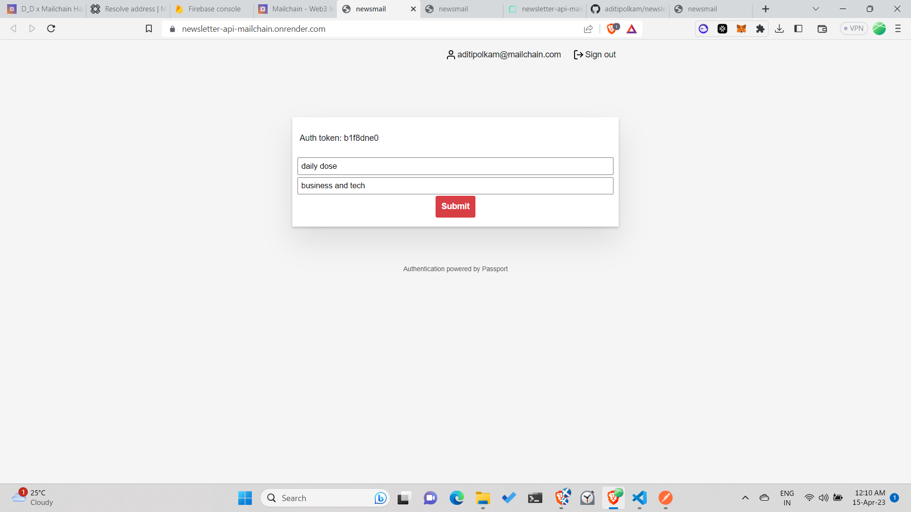
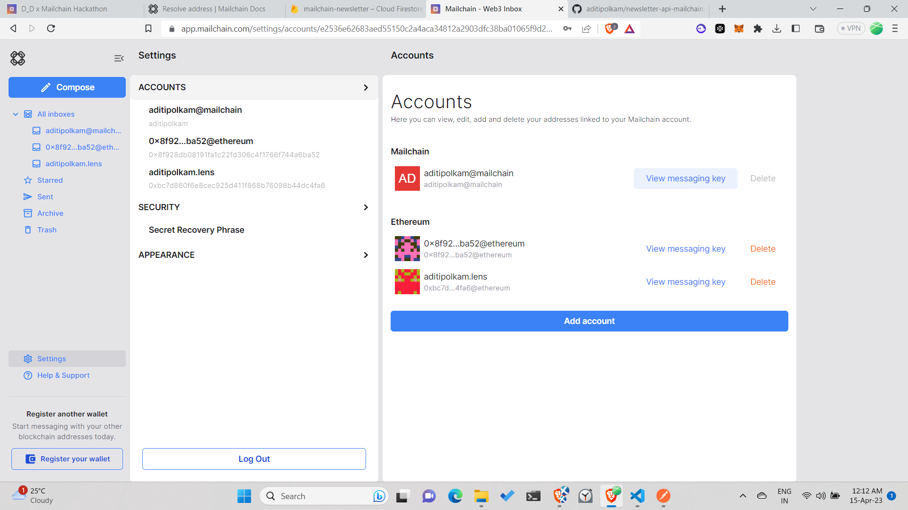
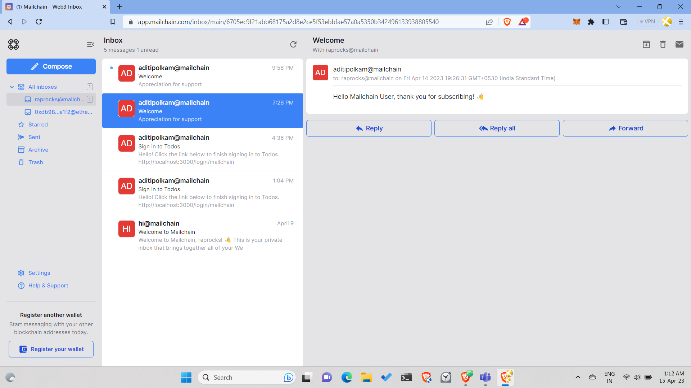

## A newsletter API service 

Customize your newsletter UI as you want, however you want!

This service will handle all the logic, from creating your newsletter, to sending your updates to the subscriber base.

Server Base and Dashboard URL - [`https://newsletter-api-mailchain.onrender.com`](https://newsletter-api-mailchain.onrender.com)

### To get started: 
log in to the dashboard to create your newsletter


enter your mailchain address


open your mailchain inbox and click on the link to sign in


after verfication, your dashboard will showup
copy your auth token and save it for sending requests
enter your newsletter name and desc - click submit to create your newsletter


your mailchain address's messaging_key can be found here after clicking settings on the left tab
please make sure to have copied the key associated with the account you used to log into the dashboard


### API endpoints

newsletters are mapped uniquely to a mailchain user address and hence `id` here specifies the newsletter creator's mailchain address, for eg: aditipolkam@mailchain.com

1. newsletter details: GET - /get-newsletter/:id

sample request api- https://newsletter-api-mailchain.onrender.com/get-newsletter/aditipolkam@mailchain.com   

```shell

//response object example
{
    "id": "aditipolkam@mailchain.com", //string
    "name": "daily dose", //string
    "description": "business and tech", //string
    "launch": {
        "_seconds": 1681480240,
        "_nanoseconds": 428000000
    },   //Date
    "subscribers": [
        "raprocks@mailchain.com"
    ] //array
}

```
2.  subscribers for a newsletter: GET - /get-subscribers/:id
```shell
//response object example
{
    "subscribers": [
        "raprocks@mailchain.com"
    ]
}
```

3. subscribe to a newsletter: POST - subscribe-newsletter/:id
```shell
//example request
fetch(url,{
    method:POST,
    headers:{
        Content-Type:"application/json"
    },
    body:{
        mail:"raprocks@mailchain.com"
    }
})

```

Status Codes:

200 - Ok. Subscribed successfully

201 - Already subscribed

400 - Possibly an unvalid email provided

404 - Newsletter doesn't exist


4. send newsletter: POST - /send-newsletter/
```shell
//example request
fetch(url,{
    method:POST,
    headers:{
        Content-Type:"application/json",
        authorization: <YOUR_AUTH_TOKEN>,
        x-mailchain-messaging-key: <YOUR_MAILCHAIN_ACCOUNT_MESSAGING_KEY>
    },
    body:{
        subject:"Welcome",
        title:"Appreciation for support",
        content:"<p>Hello Mailchain User, thank you for subscribing! 👋</p>"
    }
})

```

Status Codes:
400 - Bad Request, authorization header or x-mailchain-messaging-key header not set

401 - Unauthorized auth token

404 - No such newsletter

201 - Newsletter sent successfully


Result:
subscriber inbox page - with received mail 



## Development 


Installation
```shell
git glone https://github.com/aditipolkam/newsletter-api-mailchain
npm install
```

Run
```shell
node app.js
```
